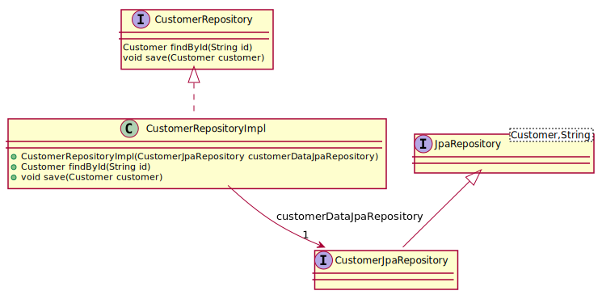
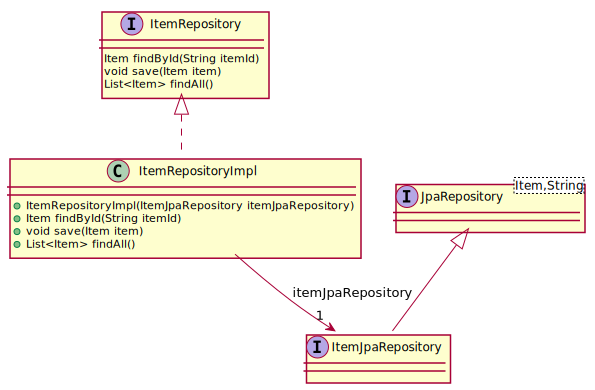
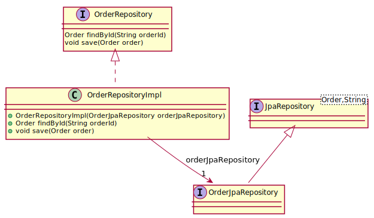

# Spring-Shop
Formation spring : shop application exemple
------------
Installation

    Cloner le projet : https://github.com/desprez/spring-shop.git
    Lancer un mvn package

------------
## Customer (couches Domain & Infrastructure)

Instructions:
> Dans la couche domain, créer une classe **Customer** comprenant 2 attributs :
 - name (String)
 - password (String)

> Créer l'interface **CustomerRepository** dans la couche **domain** puis l'implémentation dans la couche **infrastructure**.

> Créer le test unitaire correspondant permettant de récupérer un **Customer** depuis la base de données.
(utiliser un identifiant trouvé dans le fichier import.sql) ainsi qu'un test unitaire permettant de stocker le Customer dans la base de Données.

> Créer l'implémentation du repository en utilisant une interface qui étend **JpaRepository<Customer, String>** à l'aide de 2 méthodes **findById()** et **save()**.

voir **correction** dans https://github.com/desprez/spring-shop/tree/add_customer_feature

## Item (couches Domain & Infrastructure)

Instructions:
> Faire de même avec la classe **Item** qui possèdera les 2 attributs :
 - description (String)
 - price (Integer)

> Ajouter le test unitaire avec les 2 mêmes méthodes **findById()** et **save()** ainsi qu'une méthode **findAll()** pour le repository adequat.

> Décommenter les ordres SQL Inserts **ITEM** dans le fichier import.sql

voir **correction** dans https://github.com/desprez/spring-shop/tree/add_item_feature

## Order (couches Domain & Infrastructure)

Instructions:
> Faire de même avec la classe **Order** qui possèdera les 2 attributs :
 - customer (Customer)
 - items (List<<Item>>)

> Ajouter le test unitaire avec les 2 mêmes méthodes **findById()** et **save()** pour le repository adequat.

> Décommenter les ordres SQL Inserts **ORDERS** et **ITEMS_ORDERS** dans le fichier import.sql

voir **correction** dans https://github.com/desprez/spring-shop/tree/add_order_feature

## CustomerService (couche application)

Instructions:
> Dans la couche **application**, implementer le service **OrderService** pour l'interface ci-dessous:

      public interface CustomerService {

       /**
        * Create a new customer
        * @param customer the Customer to create
        * @return the created Customer
        */
       public Customer create(Customer customer);

       /**
        * Retrieve a customer according to the given identifier.
        * @param customerId the customer identifier
        * @return the retrieved Customer
        */
       public Customer findOne(String customerId);

      }
> La méthode **create()** devra vérifier qu'un **Customer** portant le même nom (name) n'existe pas déjà dans la base de données à l'aide d'une méthode findByName(name) de **CustomerJpaRepository**.  
> Les tests devront être autonomes et utiliser des mocks pour bouchonner l'accès au données.

voir **correction** dans https://github.com/desprez/spring-shop/tree/implements_customer_service

## ItemService (couche application)

Instructions:
> Dans la couche **application**, implementer le service **ItemService** pour l'interface ci-dessous:

    public interface ItemService {

     /**
      * Add Item to the catalog
      *
      * @param item the item to add
      * @return the new added item
      */
     public Item addItem(Item item);

     /**
      * Display items catalog
      *
      * @return a list of item entities
      */
     public List<Item> getAllItems();

    }

> Les tests devront être autonomes et utiliser des mocks pour bouchonner l'accès au données.

voir **correction** dans https://github.com/desprez/spring-shop/tree/implements_remaining_services

## OrderService (couche application)

> Toujours la couche **application**, implementer les méthodes **getOrdersForCustomer()** et **addOrder()** pour le service **OrderService** tel que l'interface ci-dessous:

      public interface OrderService {

       /**
        * Add new order according to the given customer id and items ids.
        *
        * @param CustomerId the customerId
        * @param itemIds    list of items ids
        * @return new order filled with the order SUM
        */
       public Order addOrder(String CustomerId, List<String> itemIds);

       /**
        * Get Order according to the given orderId
        *
        * @param orderId the order id
        * @return an Order
        */
       public Order findOne(String orderId);

       /**
        * Retrieve all orders for a customer according to the customer id.
        * @param customerId the customer id
        * @return a List of Orders
        */
       public List<Order> getOrdersForCustomer(String customerId);

      }

> La méthode **getOrdersForCustomer()** devra utiliser une méthode findByCustomerId(customerId) de **OrderJpaRepository**. 

> Les tests devront être autonomes et utiliser des mocks pour bouchonner l'accès au données.

voir **correction** dans https://github.com/desprez/spring-shop/tree/implements_remaining_services

## ItemResource (couche Exposition)

Instructions:
> Maintenant nous allons exposer les méthodes du service **ItemService** sous forme de API Rest dans la classe **ItemResource** :

- List<ItemDto> getAllItemsUsingGet()
- addItemUsingPost(ItemLightDto)
    
implémenter les 2 dto :
- ItemLightDto pour les données en entrée (sans id)
- ItemDto pour les données en sortie (avec id)

> Ainsi que le **ItemMapper** qui devra étendre **AbstractMapper** pour mapper les entités vers ces dto et inversement.

> Lancer l'application à l'aide de la classe **SpringBootApp**

voir **correction** dans https://github.com/desprez/spring-shop/tree/add_item_controller

## CustomerResource (couche Exposition)

Instructions:
> Exposer les méthodes du service **CustomerService** sous forme de API Rest dans la classe **CustomerResource** :

- getCustomer(String)
- addCustomerUsingPost(CustomerLightDto)
- updateCustomerUsingPut(CustomerDto)
    
implémenter les 2 dto :
- CustomerLightDto pour les données en entrée (sans id)
- CustomerDto pour les données en sortie (avec id)

Ainsi que le **CustomerMapper**.

voir **correction** dans https://github.com/desprez/spring-shop/tree/add_customer_controller

## OrderResource (couche Exposition)

Instructions:
> Exposer les méthodes du service **OrderService** sous forme de API Rest dans la classe **OrderResource** :

- addOrder(OrderLightDto)
- getOrders(String)
    
implémenter les 2 dto :
- OrderLightDto pour les données en entrée contenant un identifiant de customer (customerId) et une liste d'identifiants d'Item (itemIds).
- CustomerDto pour les données en sortie (avec id)

Ainsi que le **OrderMapper**.

voir **correction** dans https://github.com/desprez/spring-shop/tree/add_order_controller

## Documentation de l'API avec Swagger

Instructions:
> Ajouter les 2 dépendences **Springfox** dans dependency managment du pom.xml parent :

			<dependency>
				<groupId>io.springfox</groupId>
				<artifactId>springfox-swagger2</artifactId>
				<version>${springfox-version}</version>
			</dependency>
			<dependency>
				<groupId>io.springfox</groupId>
				<artifactId>springfox-swagger-ui</artifactId>
				<version>${springfox-version}</version>
			</dependency>
            
> Ajouter les 2 dépendanceS **Springfox** dan les dependences du pom.xml du module **exposition**

		<!-- springfox-swagger2 dependencies -->
		<dependency>
			<groupId>io.springfox</groupId>
			<artifactId>springfox-swagger2</artifactId>
		</dependency>
		<dependency>
			<groupId>io.springfox</groupId>
			<artifactId>springfox-swagger-ui</artifactId>
		</dependency>
        
> Documenter les API de fournir une interface swagger-ui.

voir **correction** dans https://github.com/desprez/spring-shop/tree/add_swagger_documentation

## Exception management

Instructions:
> Dans la classe **ExceptionTranslator** du module exposition, rajouter la gestion de l'exception **AlreadyExistingException** et retourner un code erreor HTTP **409** lors de la levée de cette exception.
> Documenter cette erreur dans la méthode de création de classe **CustomerResource**.

voir **correction** dans https://github.com/desprez/spring-shop/tree/exception_management

## Validation

Instructions:
>

voir **correction** 

## MVC

Instructions:
>

voir **correction** 

## Sécurité

Instructions:
>

voir **correction**
