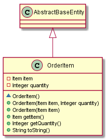
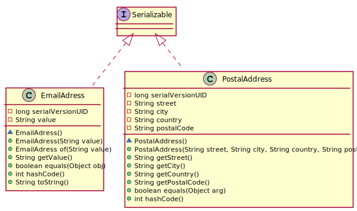
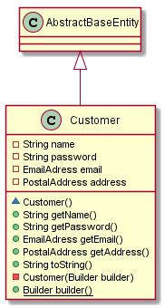

# Spring-Shop
Formation spring : shop application exemple

------------
## Installation

    Cloner le projet : https://github.com/desprez/spring-shop.git
    Lancer un mvn package

------------
## Customer (couches Domain & Infrastructure)

**User Story # 1: Enregistrer un client (customer)**

 **En tant que** client

 **Je veux** pouvoir m'enrôler sur le système

 **Afin** de pouvoir passer des commandes

Instructions:
> Dans la couche domain, créer une classe **Customer** comprenant 2 attributs :
 - name (String)
 - password (String)

> Créer l'interface **CustomerRepository** dans la couche **domain** puis l'implémentation dans la couche **infrastructure**.

> Créer le test unitaire correspondant permettant de récupérer un **Customer** depuis la base de données.
(utiliser un identifiant trouvé dans le fichier import.sql) ainsi qu'un test unitaire permettant de stocker le Customer dans la base de Données.

> Créer l'implémentation du repository en utilisant une interface qui étend **JpaRepository<Customer, String>** à l'aide de 2 méthodes **findById()** et **save()**.


voir **correction** dans https://github.com/desprez/spring-shop/tree/add_customer_feature

## Item (couches Domain & Infrastructure)

**User Story # 2: Ajouter des marchandises (items)**

 **En tant** qu'administrateur

 **Je veux** pouvoir ajouter des marchandises

 **Afin** qu'un client puisse les acheter

Instructions:
> Faire de même avec la classe **Item** qui possèdera les 2 attributs :
 - description (String)
 - price (Integer)

> Ajouter le test unitaire avec les 2 mêmes méthodes **findById()** et **save()** ainsi qu'une méthode **findAll()** pour le repository adequat.


> Décommenter les ordres SQL Inserts **ITEM** dans le fichier import.sql

voir **correction** dans https://github.com/desprez/spring-shop/tree/add_item_feature

## Order (couches Domain & Infrastructure)

**User Story # 3: Passer une commande**

 **En tant que** client

 **Je veux** pouvoir passer une commande
 
 **Afin** d'acheter des marchandises

Instructions:
> Faire de même avec la classe **Order** qui possèdera les 2 attributs :
 - customer (Customer)
 - items (List<<Item>>)

> Ajouter le test unitaire avec les 2 mêmes méthodes **findById()** et **save()** pour le repository adequat.


> Décommenter les ordres SQL Inserts **ORDERS** et **ITEMS_ORDERS** dans le fichier import.sql

voir **correction** dans https://github.com/desprez/spring-shop/tree/add_order_feature

## CustomerService (couche application)

Instructions:
> Dans la couche **application**, implementer le service **OrderService** pour l'interface ci-dessous:

```java
      public interface CustomerService {

       /**
        * Create a new customer
        * @param customer the Customer to create
        * @return the created Customer
        */
       public Customer create(Customer customer);

       /**
        * Retrieve a customer according to the given identifier.
        * @param customerId the customer identifier
        * @return the retrieved Customer
        */
       public Customer findOne(String customerId);

      }
```
> La méthode **create()** devra vérifier qu'un **Customer** portant le même nom (name) n'existe pas déjà dans la base de données à l'aide d'une méthode findByName(name) de **CustomerJpaRepository**.  
> Les tests devront être autonomes et utiliser des mocks pour bouchonner l'accès au données.

voir **correction** dans https://github.com/desprez/spring-shop/tree/implements_customer_service

## ItemService (couche application)

Instructions:
> Dans la couche **application**, implementer le service **ItemService** pour l'interface ci-dessous:
```java
    public interface ItemService {

     /**
      * Add Item to the catalog
      *
      * @param item the item to add
      * @return the new added item
      */
     public Item addItem(Item item);

     /**
      * Display items catalog
      *
      * @return a list of item entities
      */
     public List<Item> getAllItems();

    }
```

> Les tests devront être autonomes et utiliser des mocks pour bouchonner l'accès au données.

voir **correction** dans https://github.com/desprez/spring-shop/tree/implements_remaining_services

## OrderService (couche application)

> Toujours la couche **application**, implementer les méthodes **getOrdersForCustomer()** et **addOrder()** pour le service **OrderService** tel que l'interface ci-dessous:

```java
      public interface OrderService {

       /**
        * Add new order according to the given customer id and items ids.
        *
        * @param CustomerId the customerId
        * @param itemIds    list of items ids
        * @return new order filled with the order SUM
        */
       public Order addOrder(String CustomerId, List<String> itemIds);

       /**
        * Get Order according to the given orderId
        *
        * @param orderId the order id
        * @return an Order
        */
       public Order findOne(String orderId);

       /**
        * Retrieve all orders for a customer according to the customer id.
        * @param customerId the customer id
        * @return a List of Orders
        */
       public List<Order> getOrdersForCustomer(String customerId);

      }
```
> La méthode **getOrdersForCustomer()** devra utiliser une méthode findByCustomerId(customerId) de **OrderJpaRepository**. 

> Les tests devront être autonomes et utiliser des mocks pour bouchonner l'accès au données.

voir **correction** dans https://github.com/desprez/spring-shop/tree/implements_remaining_services

## ItemResource (couche Exposition)

Instructions:
> Maintenant nous allons exposer les méthodes du service **ItemService** sous forme de API Rest dans la classe **ItemResource** :

- List<ItemDto> getAllItemsUsingGet()
- addItemUsingPost(ItemLightDto)
    
implémenter les 2 dto :
- ItemLightDto pour les données en entrée (sans id)
- ItemDto pour les données en sortie (avec id)

> Ainsi que le **ItemMapper** qui devra étendre **AbstractMapper** pour mapper les entités vers ces dto et inversement.

> Lancer l'application à l'aide de la classe **SpringBootApp**

voir **correction** dans https://github.com/desprez/spring-shop/tree/add_item_controller

## CustomerResource (couche Exposition)

Instructions:
> Exposer les méthodes du service **CustomerService** sous forme de API Rest dans la classe **CustomerResource** :

- getCustomer(String)
- addCustomerUsingPost(CustomerLightDto)
- updateCustomerUsingPut(CustomerDto)
    
implémenter les 2 dto :
- CustomerLightDto pour les données en entrée (sans id)
- CustomerDto pour les données en sortie (avec id)

Ainsi que le **CustomerMapper**.

voir **correction** dans https://github.com/desprez/spring-shop/tree/add_customer_controller

## OrderResource (couche Exposition)

Instructions:
> Exposer les méthodes du service **OrderService** sous forme de API Rest dans la classe **OrderResource** :

- addOrder(OrderLightDto)
- getOrders(String)
    
implémenter les 2 dto :
- OrderLightDto pour les données en entrée contenant un identifiant de customer (customerId) et une liste d'identifiants d'Item (itemIds).
- CustomerDto pour les données en sortie (avec id)

Ainsi que le **OrderMapper**.

voir **correction** dans https://github.com/desprez/spring-shop/tree/add_order_controller

## Documentation de l'API avec Swagger

Instructions:
> Sans les fichiers pom.xml, supprimer les dépendences à **org.springdoc** s'il y en a.

> Ajouter les 2 dépendences **Springfox** ci-dessous dans **dependency managment** du pom.xml parent :
```xml
			<dependency>
				<groupId>io.springfox</groupId>
				<artifactId>springfox-swagger2</artifactId>
				<version>${springfox-version}</version>
			</dependency>
			<dependency>
				<groupId>io.springfox</groupId>
				<artifactId>springfox-swagger-ui</artifactId>
				<version>${springfox-version}</version>
			</dependency>
```
> Ajouter les 2 dépendances **Springfox** ci-dessous dans le pom.xml du module **exposition**
```xml
		<!-- springfox-swagger2 dependencies -->
		<dependency>
			<groupId>io.springfox</groupId>
			<artifactId>springfox-swagger2</artifactId>
		</dependency>
		<dependency>
			<groupId>io.springfox</groupId>
			<artifactId>springfox-swagger-ui</artifactId>
		</dependency>
```
> Ajouter les 2 classes **SwaggerConfig** et **SwaggerResource** dans le package **fr.training.samples.spring.shop.config.swagger** :
```java
	import java.time.LocalDate;
	import java.time.ZonedDateTime;

	import org.springframework.context.annotation.Bean;
	import org.springframework.context.annotation.Configuration;

	import springfox.documentation.builders.ApiInfoBuilder;
	import springfox.documentation.builders.RequestHandlerSelectors;
	import springfox.documentation.service.ApiInfo;
	import springfox.documentation.service.Contact;
	import springfox.documentation.spi.DocumentationType;
	import springfox.documentation.spring.web.plugins.Docket;
	import springfox.documentation.swagger2.annotations.EnableSwagger2;

	@Configuration
	@EnableSwagger2
	public class SwaggerConfig {

		@Bean
		public Docket customImplementation() {

			return new Docket(DocumentationType.SWAGGER_2).select()
					.apis(RequestHandlerSelectors.basePackage("fr.training.samples.spring.shop.exposition")).build()
					.directModelSubstitute(LocalDate.class, java.sql.Date.class)//
					.directModelSubstitute(ZonedDateTime.class, java.util.Date.class) //
					.apiInfo(apiInfo());
		}

		ApiInfo apiInfo() {
			return new ApiInfoBuilder()//
					.title("Swagger spring-shop") //
					.description("No description provided") //
					.license("Apache 2.0") //
					.licenseUrl("http://www.apache.org/licenses/LICENSE-2.0.html") //
					.termsOfServiceUrl("") //
					.version("1.0") //
					.contact(new Contact("Some one", "http://localhost:8080", "SomeOne@training.org")) //
					.build();
		}
	}
```

```java
	import org.slf4j.Logger;
	import org.slf4j.LoggerFactory;
	import org.springframework.stereotype.Controller;
	import org.springframework.web.bind.annotation.RequestMapping;

	/**
	 * Resource redirection to swagger api documentation
	 */
	@Controller
	public class SwaggerResource {

		private static final Logger LOG = LoggerFactory.getLogger(SwaggerResource.class);

		/**
		 * Default constructor
		 */
		public SwaggerResource() {
			super();
		}

		@RequestMapping(value = "/")
		public String index() {
			LOG.info("swagger-ui.html");
			return "redirect:swagger-ui.html";
		}

	}
```
> Lancer l'application et afficher la page http://localhost:8080/swagger-ui.html

> Documenter les API de fournir une interface swagger-ui.

voir **correction** dans https://github.com/desprez/spring-shop/tree/add_swagger_documentation

## Exception management

Instructions:
> Dans la classe **ExceptionTranslator** du module **exposition**, rajouter la gestion de l'exception **AlreadyExistingException** et retourner un code erreur HTTP **409** lors de la levée de cette exception.
> Documenter cette erreur dans la méthode de création de classe **CustomerResource**.

voir **correction** dans https://github.com/desprez/spring-shop/tree/exception_management

## Validation

Instructions:
> Ajouter les contrôles de surfaces sur l'object permettant la création d'un **Item** :
- Le prix (price) doit être positif > 0.
- La description doit au moins contenir un caractère.

> Ajouter les contrôles de surfaces sur l'object permettant la création d'un **Customer** :
- Le nom (name) et le mot de passe (password) doivent au moins contenir un caractère. 

> Ajouter les contrôles de surfaces sur l'object permettant la création d'un **Order** :
- L'identifiant du customer doit être présent.
- La liste des identifiants doit au moins contenir un élément.

voir **correction** dans https://github.com/desprez/spring-shop/tree/input_validation

## Spring MVC DEMO (optionnel)

Instructions:

> Faire un checkout de la branche https://github.com/desprez/spring-shop/tree/spring_mvc_demo

> Dans une fenêtre de commande ou un terminal depuis l'IDE, lancer l'application **Back-end**, via la commande suivante dans le module **exposition** :

	mvn clean install
	cd exposition
	mvn spring-boot:run
	
> Dans l'IDE lancer l'application **Front-End** via la classe **SpringBootApp** du module **presentation-mvc**.

> Accèder à l'url : http://localhost:8081

> Se connecter avec le compte **utilisateur** (user, password) ou le compte **administrateur** (admin, admin)> 


## Sécurité avec Json Web Stoken (JWT)

Instructions:
> Ajouter la dépendence **Spring security** dans le pom.xml du module **application** :
```xml
        	<!-- Spring security -->
		<dependency>
			<groupId>org.springframework.boot</groupId>
			<artifactId>spring-boot-starter-security</artifactId>
		</dependency>
```
> Ajouter les dépendences **jjwt** et **spring-security-test** dans le pom.xml du module **exposition** :
```xml
		<dependency>
			<groupId>io.jsonwebtoken</groupId>
			<artifactId>jjwt</artifactId>
			<version>0.9.1</version>
		</dependency>

		<!-- spring-security-test dependencies -->
		<dependency>
			<groupId>org.springframework.security</groupId>
			<artifactId>spring-security-test</artifactId>
			<scope>test</scope>
		</dependency>
```
> ajouter la propriété suivante dans le fichier application.yml
```yaml
# used to verify this hash if you have the secret key.
jwt:
  secret: spring-shop
```
> Dans le package fr.training.samples.spring.shop.domain.customer ajouter l'énumaration suivante :
```java
	public enum RoleTypeEnum {
		ROLE_USER, ROLE_ADMIN
	}
```
> Dans la classe **Customer** rajouter une proprieté **roles**  de type Set<RoleTypeEnum> annotée @ElementCollection et @Enumerated.
```java
	@ElementCollection
	@Enumerated(EnumType.STRING)
	Set<RoleTypeEnum> roles = new HashSet<>();
```
> Ajouter aussi le getter et la méthode addRole() :
```java
	public void addRole(final RoleTypeEnum role) {
		roles.add(role);
	}
```
> Dans la classe **CustomerServiceImpl** injecter un **org.springframework.security.crypto.password.PasswordEncoder**

> Toujours dans cette classe, dans la méthode **create()**, utiliser ce **Passwordencoder** pour encoder le password et ajouter le Role **ROLE_USER** par défaut avant de sauvegarder le Customer:
```java
		// Encode given password
		customer.setPassword(passwordEncoder.encode(customer.getPassword()));
		
		// New customer has user role by default
		customer.addRole(RoleTypeEnum.ROLE_USER);
```
> Encoder aussi le password dans la méthode **update()**.

> Corriger le test **CustomerServiceTest** en injectant un Mock de PasswordEncoder.

> Rajouter la classe **UserDetailsServiceImpl** ci-dessous dans le package fr.training.samples.spring.shop.application.security :
```java
	import java.util.Collection;

	import org.slf4j.Logger;
	import org.slf4j.LoggerFactory;
	import org.springframework.beans.factory.annotation.Autowired;
	import org.springframework.security.core.GrantedAuthority;
	import org.springframework.security.core.authority.AuthorityUtils;
	import org.springframework.security.core.userdetails.User;
	import org.springframework.security.core.userdetails.UserDetails;
	import org.springframework.security.core.userdetails.UserDetailsService;
	import org.springframework.security.core.userdetails.UsernameNotFoundException;
	import org.springframework.stereotype.Service;
	import org.springframework.transaction.annotation.Transactional;

	import fr.training.samples.spring.shop.domain.customer.Customer;
	import fr.training.samples.spring.shop.domain.customer.CustomerRepository;

	@Service
	@Transactional
	public class  UserDetailsServiceImpl implements UserDetailsService {

		private static Logger logger = LoggerFactory.getLogger(UserDetailsServiceImpl.class);

		@Autowired
		private CustomerRepository customerRepository;

		// ici je transforme mes objets du domain en objets internes de Spring Security
		@Override
		public UserDetails loadUserByUsername(final String customerName) throws UsernameNotFoundException {

			final Customer customer = customerRepository.findByCustomerName(customerName);
			if (customer == null) {
				throw new UsernameNotFoundException("Email " + customerName + " not found");
			}
			logger.debug("Customer found with name {}", customerName);
			return new User(customer.getName(), customer.getPassword(), getAuthorities(customer));
		}

		private static Collection<? extends GrantedAuthority> getAuthorities(final Customer customer) {
			final String[] userRoles = customer.getRoles().stream().map((role) -> role.name()).toArray(String[]::new);
			logger.debug("With User Roles {}", userRoles);
			final Collection<GrantedAuthority> authorities = AuthorityUtils.createAuthorityList(userRoles);
			return authorities;
		}
	}
```
> Ajouter la classe **SecurityConfig** dans le package fr.training.samples.spring.shop.config.security
```java
	import org.springframework.beans.factory.annotation.Autowired;
	import org.springframework.context.annotation.Bean;
	import org.springframework.context.annotation.Configuration;
	import org.springframework.security.authentication.AuthenticationManager;
	import org.springframework.security.config.annotation.authentication.builders.AuthenticationManagerBuilder;
	import org.springframework.security.config.annotation.method.configuration.EnableGlobalMethodSecurity;
	import org.springframework.security.config.annotation.web.builders.HttpSecurity;
	import org.springframework.security.config.annotation.web.configuration.EnableWebSecurity;
	import org.springframework.security.config.annotation.web.configuration.WebSecurityConfigurerAdapter;
	import org.springframework.security.config.http.SessionCreationPolicy;
	import org.springframework.security.core.userdetails.UserDetailsService;
	import org.springframework.security.crypto.bcrypt.BCryptPasswordEncoder;
	import org.springframework.security.crypto.password.PasswordEncoder;
	import org.springframework.security.web.authentication.UsernamePasswordAuthenticationFilter;

	import fr.training.samples.spring.shop.config.security.jwt.JwtAuthenticationEntryPoint;
	import fr.training.samples.spring.shop.config.security.jwt.JwtRequestFilter;

	@Configuration
	@EnableWebSecurity
	@EnableGlobalMethodSecurity(securedEnabled = true, proxyTargetClass = true)
	public class SecurityConfig extends WebSecurityConfigurerAdapter {

		@Autowired
		private UserDetailsService userDetailsService;

		@Autowired
		private JwtRequestFilter jwtRequestFilter;

		@Autowired
		private JwtAuthenticationEntryPoint jwtAuthenticationEntryPoint;

		@Override
		public void configure(final AuthenticationManagerBuilder auth) throws Exception {
			auth.userDetailsService(userDetailsService).passwordEncoder(passwordEncoder());
		}

		@Bean
		public PasswordEncoder passwordEncoder() {
			return new BCryptPasswordEncoder();
		}

		@Bean
		@Override
		public AuthenticationManager authenticationManagerBean() throws Exception {
			return super.authenticationManagerBean();
		}

		@Override
		protected void configure(final HttpSecurity httpSecurity) throws Exception {
			// Add a filter to validate the tokens with every request
			httpSecurity.addFilterBefore(jwtRequestFilter, UsernamePasswordAuthenticationFilter.class);

			httpSecurity.csrf().disable()
			// dont authenticate this authentication request
			.authorizeRequests().antMatchers("/authenticate").permitAll()
			// and authorize swagger-ui
			.antMatchers("/v2/api-docs", "/configuration/**", "/swagger*/**", "/webjars/**").permitAll()
			// all other requests need to be authenticated
			.anyRequest().authenticated().and().
			// make sure we use stateless session; session won't be used to
			// store user's state.
			exceptionHandling().authenticationEntryPoint(jwtAuthenticationEntryPoint) //
			.and().sessionManagement().sessionCreationPolicy(SessionCreationPolicy.STATELESS);
		}
	}
```
> Ajouter les classes JwtAuthenticationController, JwtAuthenticationEntryPoint, JwtRequest, JwtRequestFilter, JwtResponse, JwtTokenManager pour la gestion du JWT. (voir branche)

> Insérer l'utilisateur **Admin** dans la base de données avec son rôle dans les tables **CUSTOMER** et **CUSTOMER_ROLES**  :
```sql
	INSERT INTO CUSTOMER (ID, NAME, PASSWORD,VERSION) VALUES ('bd20a450-dee7-4253-bf48-7fee4d0cebc6', 'Admin', '$2a$10$hKDVYxLefVHV/vtuPhWD3OigtRyOykRLDdUAp80Z1crSoS1lFqaFS',0);
	INSERT INTO CUSTOMER_ROLES(CUSTOMER_ID, ROLES) VALUES ('bd20a450-dee7-4253-bf48-7fee4d0cebc6','ROLE_ADMIN');
```
> Ajouter dans la classe **ExceptionTranslator**, la prise en compte de l'exception **AccessDeniedException** :

```java
	@ExceptionHandler(AccessDeniedException.class)
	@ResponseBody
	public ResponseEntity<Object> accessDeniedExceptionHandler(final AccessDeniedException ex) {

		final ErrorModel apiError = ErrorModel.builder() //
				.message(ex.getLocalizedMessage()) //
				.description("You have'nt access privilege to this operation")//
				.build();

		LOG.debug(ex.getMessage());

		return new ResponseEntity<>(apiError, HttpStatus.FORBIDDEN);
	}
```
> Dans la classe **SwaggerConfig**, rajouter les mécanismes permettant de saisir le token :

Dans la méthode customImplementation, rajouter les **securityContexts** et **securitySchemes** :
```java
	@Bean
	public Docket customImplementation() {
		return new Docket(DocumentationType.SWAGGER_2).select()
				.apis(RequestHandlerSelectors.basePackage("fr.training.samples.spring.shop.exposition")).build()
				.directModelSubstitute(LocalDate.class, java.sql.Date.class)//
				.directModelSubstitute(ZonedDateTime.class, java.util.Date.class) //
				.apiInfo(apiInfo()) //
				.securityContexts(Arrays.asList(securityContext())) //
				.securitySchemes(Arrays.asList(apiKey()));
	}
```	
puis les méthodes suivantes :
```java
        private ApiKey apiKey() {
		return new ApiKey("JWT", AUTHORIZATION_HEADER, "header");
	}

	private SecurityContext securityContext() {
		return SecurityContext.builder().securityReferences(defaultAuth()).build();
	}

	List<SecurityReference> defaultAuth() {
		final AuthorizationScope authorizationScope = new AuthorizationScope("global", "accessEverything");
		final AuthorizationScope[] authorizationScopes = new AuthorizationScope[1];
		authorizationScopes[0] = authorizationScope;
		return Arrays.asList(new SecurityReference("JWT", authorizationScopes));
	}
```			

> Ajouter les annotations **@Secured("ROLE_USER")** et **@Secured("ROLE_ADMIN")** pour que :
- Seul un administrateur puisse créer un nouvel item.
- Seuls les customers peuvent créer des commandes et modifier leur compte.

voir **correction** dans https://github.com/desprez/spring-shop/tree/spring_security_jwt

## Spring Actuator
Instructions:

> Repartir de la branche https://github.com/desprez/spring-shop/tree/input_validation

> Vérifier la présence de la dépendence **spring-boot-actuator** dans le module **Exposition** :
```xml
		<dependency>
			<groupId>org.springframework.boot</groupId>
			<artifactId>spring-boot-starter-actuator</artifactId>
		</dependency>
```	
> Ajouter les endpoints **actuator** dans le fichier application.yml :
```yaml
#Monitoring endpoints   
management:
  endpoints:
    web:
      exposure:
        include: info, health, configprops, logfile, metrics, env, loggers
```
> Exposer les métriques de chaque contrôleur REST à l’aide de l’annotation @Timed

> Accéder au différentes urls d’actuator

voir **correction** dans https://github.com/desprez/spring-shop/tree/springboot_actuator

## Spring AOP
Instructions:

> Vérifier la présence de la dépendence **spring-boot-aop** dans le module **Exposition** :
```xml
	<dependency>
		<groupId>org.springframework.boot</groupId>
		<artifactId>spring-boot-starter-aop</artifactId>
	</dependency>
```
> Ajouter la classe **AOPConfiguration** pour la configuration de AOP :
```java
	import org.springframework.context.annotation.Configuration;
	import org.springframework.context.annotation.EnableAspectJAutoProxy;

	@Configuration
	@EnableAspectJAutoProxy
	public class AOPConfiguration {
	}
```
> Ajouter un 1er aspect qui va permettre de tracer les appels de méthodes publiques de tous les sous packages de **fr.training.samples.spring.shop.application**.

> Ajouter un 2nd aspect qui va permettre de tracer le temps passé lors des appels de méthodes publiques de tous les sous package de **fr.training.samples.spring.shop.application**.

voir **correction** dans https://github.com/desprez/spring-shop/tree/add_aspect
# Batch

Dans les étapes suivantes nous allons créer un module Batch utilisant **SpringBatch** afin d'exécuter des traitements par lots.

## Ajout d'un module Batch

Instructions:
> Dans le répertoire **Spring-shop**, créer un sous-répertoire **batch**

> Créer un fichier pom.xml contenant les dépendances suivantes :
- fr.training.samples:spring-shop-infrastructure (scope runtime)
- fr.training.samples:spring-shop-application
- org.springframework.boot:spring-boot-starter-batch
- org.springframework.boot:spring-batch-test (scope test)

> Créér une classe **SpringBootBatchApp** dans le package **fr.training.samples.spring.shop** contenant les annotations **@SpringBootApplication** et **@EnableBatchProcessing**.
 
```java
@SpringBootApplication
@EnableBatchProcessing
public class SpringBootBatchApp {

	public static void main(final String[] args) {
		final ApplicationContext context = SpringApplication.run(SpringBootBatchApp.class, args);
		System.exit(SpringApplication.exit(context));
	}

}
```

voir **correction** dans https://github.com/desprez/spring-shop/tree/init_batch_module

## Ajout d'un job d'export

Notre "Business Analyst" nous demande de rajouter une nouvelle fonctionnalité permettant d'exporter dans un fichier csv la liste des clients qui se sont enregistrés dans l'application afin de l'envoyer au service marketing.

Instructions:
> Dans le package **fr.training.samples.spring.shop.exportjob** :

> Créer la classe **CusomerDto** qui va contenir les informations contenues dans chaque enregistrement de la table CUSTOMER.

> Créer la classe **ExportCustomerJobConfig** permettant de configurer le job d'export des Customers.

> Dans cette classe nous allons déclarer le job **export-job** dans un Bean Spring.

> Puis le Step **export-step**.

> Implémenter un Bean **exportReader** qui va renvoyer un **JdbcCursorItemReader** de **springBatch**

> Implémenter un Bean **CustomerRowMapper** qui implémente le **RowMapper** afin de peupler un **CustomerDto** avec chaque enregistrement de la table.

> Implémenter un Bean **exportWriter** qui va renvoyer un **FlatFileItemWriter**.

> Implémenter le test unitaire **ExportCustomerJobTest**

voir **correction** dans https://github.com/desprez/spring-shop/tree/add_export_job

## Ajout d'un job d'import
Le responsable "Produit" souhaiterait pouvoir importer en masse des produits dans le catalogue de l'application. Il dispose d'un fichier csv qui a la forme suivante :

id;description;price
1;Bananas;10
2;Papayas;20
3;Mangos;30
4;Pinaples;40

Instructions:

> Dans le package **fr.training.samples.spring.shop.importjob** :

> Créer la classe **ItemDto** qui va contenir les informations contenues dans chaque ligne du fichier.

> Créer la classe **ImportItemJobConfig** permettant de configurer le job d'import des Items.

> Dans cette classe nous allons déclarer le job **import-job** dans un Bean Spring. Ce job contiendra 2 steps :
- **delete-step** qui va supprimer les produits existants à l'aide d"une Tasklet.
- **import-step** qui va lire les lignes du fichier et les stocker dans **ItemDto**.

> Implémenter un Bean **importReader** qui va renvoyer un **FlatFileItemReader** de **springBatch**

> Implementer un Bean **importWriter** qui va renvoyer un **JdbcBatchItemWriter**.

> Implémenter le test unitaire **ImportItemJobTest**.

voir **correction** dans https://github.com/desprez/spring-shop/tree/add_import_job

# Domain Driven Design

## Remplacement des annotations JPA par des mappings xml

Afin de garder une couche **Domain** la plus pure possible nous allons remplacer les annotations JPA présentes dans les entités par un mapping XML dans la couche **Infrastructure**. 

> Dans la couche **Infrastructure** créer les 2 fichiers **common.orm.hbm.xml** et **customer.orm.hbm.xml** dans le répertoire META_INF de src/main/resources :

common.orm.hbm.xml
```xml
	<?xml version="1.0" encoding="UTF-8"?>
	<entity-mappings version="2.1"
		xmlns="http://xmlns.jcp.org/xml/ns/persistence/orm"
		xmlns:xsi="http://www.w3.org/2001/XMLSchema-instance"
		xsi:schemaLocation="http://xmlns.jcp.org/xml/ns/persistence/orm http://xmlns.jcp.org/xml/ns/persistence/orm_2_1.xsd">

		<access>FIELD</access>

		<mapped-superclass
			class="fr.training.samples.spring.shop.domain.common.entity.AbstractBaseEntity">
			<attributes>
				<id name="id" />
				<version name="version" />
			</attributes>
		</mapped-superclass>

	</entity-mappings>
```
customer.orm.hbm.xml
```xml
	<?xml version="1.0" encoding="UTF-8"?>
	<entity-mappings version="2.1"
		xmlns="http://xmlns.jcp.org/xml/ns/persistence/orm"
		xmlns:xsi="http://www.w3.org/2001/XMLSchema-instance"
		xsi:schemaLocation="http://xmlns.jcp.org/xml/ns/persistence/orm http://xmlns.jcp.org/xml/ns/persistence/orm_2_1.xsd">

		<access>FIELD</access>

		<entity
			class="fr.training.samples.spring.shop.domain.customer.Customer">
			<table name="CUSTOMER" />
			<attributes>
				<basic name="name" />
				<basic name="password" />
			</attributes>
		</entity>

		<entity
			class="fr.training.samples.spring.shop.domain.order.Order">
			<table name="ORDERS" />
			<attributes>
				<many-to-one name="customer" fetch="LAZY">
					<join-column name="CUSTOMER_ID" />
				</many-to-one>
				<many-to-many name="items"
					target-entity="fr.training.samples.spring.shop.domain.item.Item"
					fetch="EAGER">
					<cascade>
						<cascade-all />
					</cascade>
				</many-to-many>
			</attributes>
		</entity>

		<entity class="fr.training.samples.spring.shop.domain.item.Item">
			<table name="ITEM" />
			<attributes>
				<basic name="description" />
				<basic name="price" />
			</attributes>
		</entity>


	</entity-mappings>
```
> Ajouter les références à ces 2 fichiers dans les propriétés JPA des 2 fichiers de propriétés **application.yml** (dans les couches **Infrastructure** (test) et **Exposition** :
```yaml
...
  jpa:
    mapping-resources: 
      - META-INF/common.orm.hbm.xml
      - META-INF/customer.orm.hbm.xml
    show-sql: true
    open-in-view: false
...   
```
> Supprimer toutes les annotations **javax.persistance** dans les entités de la couche **Domaine** .

> Déplacer la dépendence **spring-boot-starter-data-jpa** du le fichier pom.xml de la couche **Domaine** dans la couche **Infrastructure** .

voir **correction** dans https://github.com/desprez/spring-shop/tree/ddd_use_xml_mappings

## Ubiquitous language

Notre "Business Analyst", nous demande de rajouter un contrôle sur le nombre de lignes de commande (OrderItems) qui doit être supérieur à zéro.

Allo, Houston, on a un problème...

...l'objet **lignes de commande** (OrderItem) n'existe pas dans notre modèle, il va falloir l'ajouter.

Instructions:
> Ajouter une classe **OrderItem**



> Ajouter le contrôle dans la classe **Order** permettant de valider que l'on ne peut pas créer une commande (Order) sans lignes (OrderItem).

Nous allons en profilter pour rendre les entités du Domaine imutable, afin de rendre explicite les modifications qui peuvent intervenir sur celle-ci.

> Supprimer les Setters de l'entité **Order** et créer le Builder qui sera responsable de la création de cette entité.

> Faire de même avec les entités **OrderItem**, **Item** et **Customer**.

voir **correction** dans https://github.com/desprez/spring-shop/tree/ddd_add_orderitem

## Aggrégats

Instructions:
> Identifier les aggrégats de l'application.

## Value Objects

Notre "Business Analyst" nous demande de rajouter une serie d'attributs permettant au Client de renseigner :
- son adresse mail 
	- email
- son adresse postale.
	- street
	- city
	- country
	- postalCode

Instructions:
> Créer les ValueObjects **EmailAdress** et **PostalAdress** dans le package **fr.training.samples.spring.shop.domain.customer**.



> Rajouter les attributs **email** (de type EmailAdress) et **address** (de type PostalAddress) correspondants dans la classe **Customer**.



> Modifier le fichier **customer.orm.hbm.xml** pour prendre en compte ces nouvelles colonnes dans la table **CUSTOMER** :

```xml
	<embedded name="email">
		<attribute-override name="value">
			<column name="EMAIL" />
		</attribute-override>
	</embedded>

	<embedded name="address">
		<attribute-override name="street">
			<column name="STREET" />
		</attribute-override>
		<attribute-override name="city">
			<column name="CITY" />
		</attribute-override>
		<attribute-override name="country">
			<column name="COUNTRY" />
		</attribute-override>
		<attribute-override name="postalCode">
			<column name="POSTAL_CODE" />
		</attribute-override>
	</embedded>
```

> Modifier le **CustomerMapper** et corriger les tests unitaires afin d'alimenter correctement ces nouveaux attributs lors de la création des objects **Customer**.
			
voir **correction** dans https://github.com/desprez/spring-shop/tree/ddd_add_value_objects
